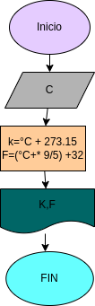

# Temperatura-

# Ejercicio N°1

programa para invertir una cantidad de grado C° en equivalente a K° y F°

# Analisis

variables de entrada (input)

c: grados centigrados/celcius

variables de proceso y salida (precessing, storage,output)

F:Grados Fahrenheit

K:Grados Kelvin

# Diseño

# Construccion
